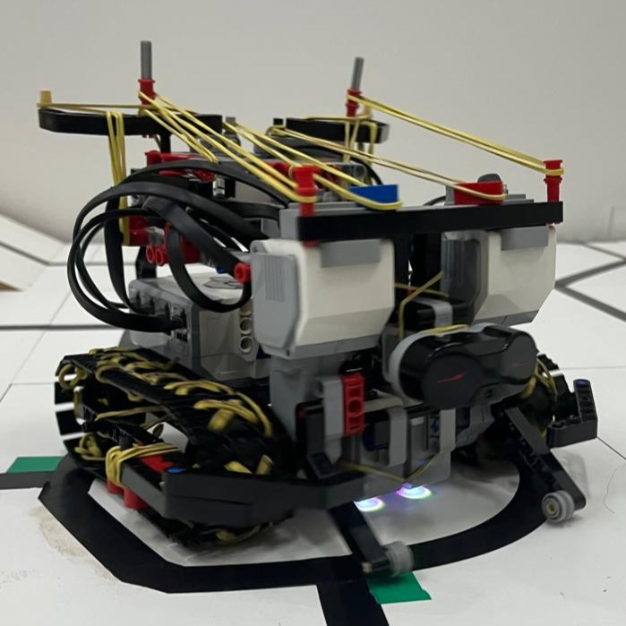
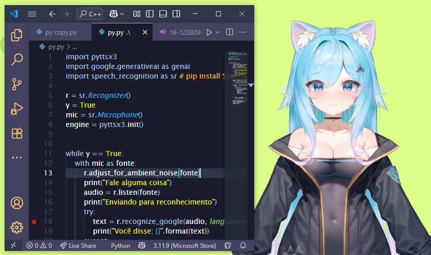
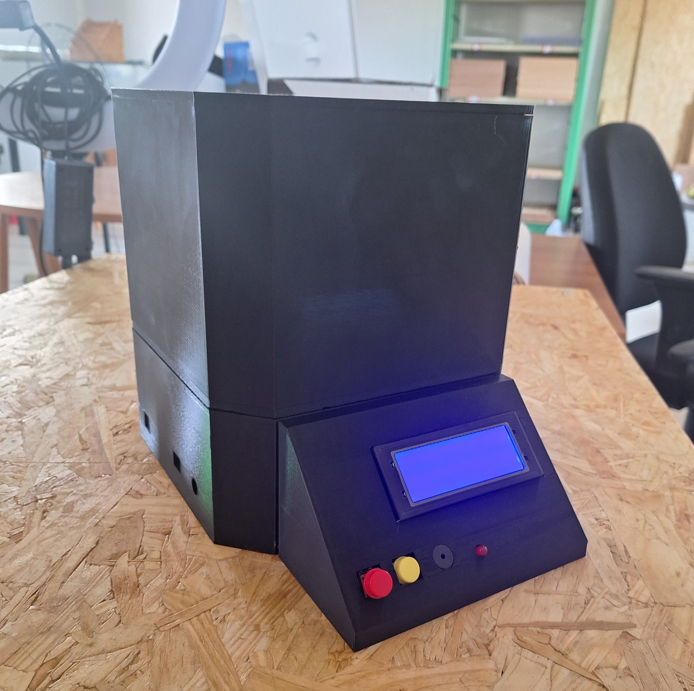

# Hello! I´m Tiago
## A Brazilian Developer 🇧🇷

I´m learning python and image processing at first, now coursing 2nd grade high school at IFMS  with a integrated system developer´s course.

 I´ve created some interesting projects like:

 |Line Follower Robot|AI API|Automatic Titulator|
 |:-----------------:|:--------------:|:-----------------:|
 ||||
